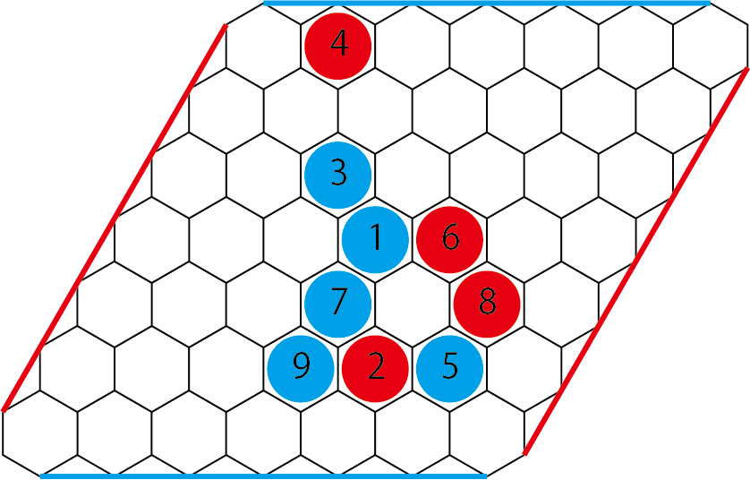
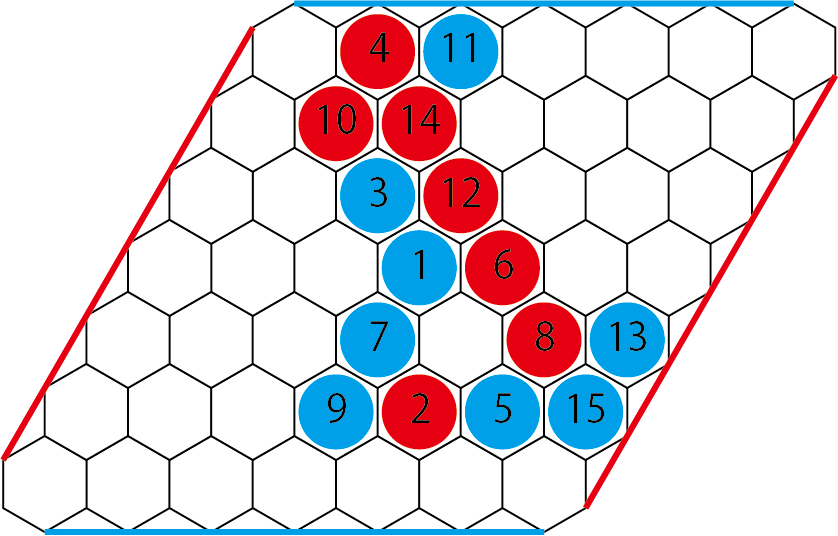
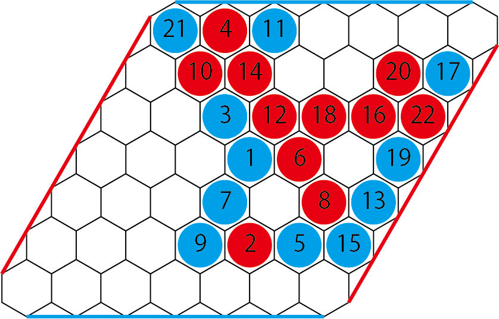
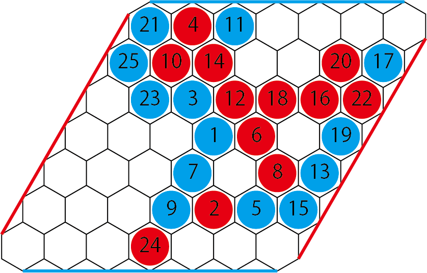
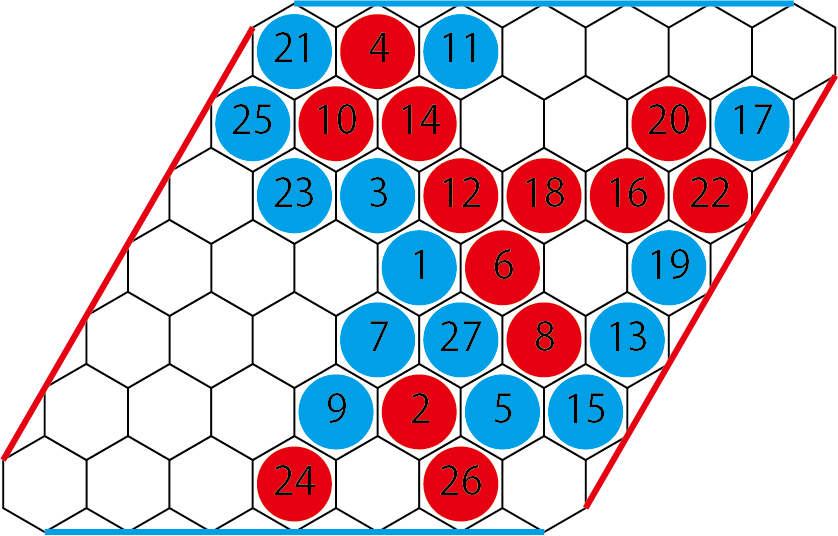
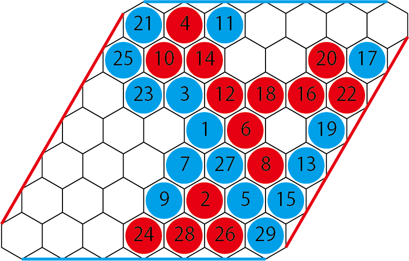

# Disthex

Disthex is a variant rule for Hex.

## Components

+ Hex board (7~14 sized)
+ black/white stones (stackable stone is good)

## Rules

Disthex has the same goal and components as Hex, but there is only one difference.
You can't play on adjacent cells that your opponent previously played on.
If component's stones are stackable, players can play stacked stones to memoize last played cell.

## Board size

In initial play of disthex, 7x7 board size is recommended.
If you want, Disthex can be played bigger board 9x9 or 11x11. 14x14 is quite big for Disthex.

## Example

1st turn, Blue plays on stone to center cell of the board. This move is always strong so Red claimed swap option. Then, player color was swaped.

With moves 5-8, Red trys to block Blue's connection between 1 and 5. With move 8, Red succeed to  block Blue's connection 1-5, but it allows Blue's 9 move to make a big group 3-1-7-9 in the center.

Blue gets lead.

With move 10, Red trys to claim upper board territories.
Move 11 is a poor move, because it doesn't block Red's connectivity of move 10 to right edge cells. If with move 11 Blue played on the next down right cell, Red couldn't play on the same cell as moves 12 and 14, and it makes good result.

Therefore, Red successes to cut Blue's connectivity of upper edges and gets big group.

Red gets a lead.

With move 18 to 20, Red makes his group bigger. Blue trys to cut Red's connectivity to right edge, but it is too late to block, so Blue tried another one.
Move 21 cuts Red's left edge connection, because Red must waste his turn to connect right edge with move 22.

Move 23 establishes Blue's upper connection, because Red can't play on cell of 25, so Red try to block bottom connection with move 24.

Red continues to block bottom edge connection, but Blue's move 27 is forking move to win.
Red lost the game.

## Note

The name of Disthex is abbreviation of Distant Hex.
The rule of Disthex was inspired from Yavalanchor.

## History

Disthex rules by airtoxin(Ryoji Ishii) 2017.
